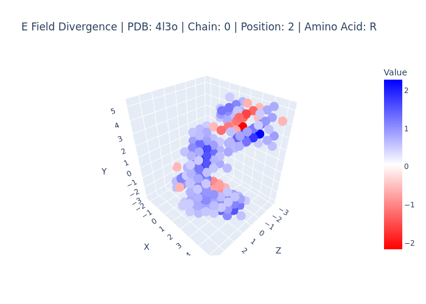
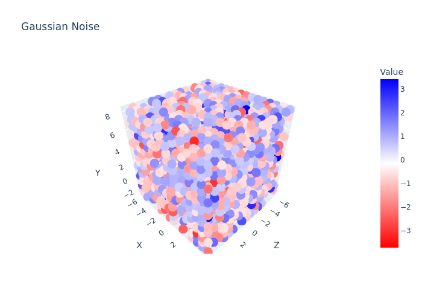

# ProteinDiff - Structure-Conditioned Latent Diffusion
## Summary

ProteinDiff is a latent diffusion model for protein sequence generation given a target backbone structure. It aims to provide a truly generative model for this problem, by reframing it in such a way that the main diffusion model can learn the score of sequence space given a target structure. 

## Setup

Thus far, I am still working on setting up the model architecture and training logic. Once this is done, I will move on to making the model scalable by adding hybrid parallelism (FSDP, PP, TP). For now, here is how to setup the environment to develop.

First you need to build the image. Make sure you have docker installed on your machine, and that you have gpus on your machine (in the process of developing some custom cuda kernels)

```shell
sudo docker build -t proteindiff:dev -f config/setup/Dockerfile .
```

Once the image is built, you can use docker compose to run a shell in the environment (debug service) or to directly train the model (train service).

```shell
sudo docker compose -f config/setup/docker-compose.yml run --rm <debug,train>
```

## Architecture
Here is a summary of the idea in broad strokes:

There are three stages for training the model:
1. SideChain VAE
2. BackBone VAE
3. Latent Diffusion

We will cover the training for each stage, before explaining how it works in inference.

### Side Chain VAE
What makes this architecture unique is how it frames the problem of inverse folding (IF) to take advantage of the atomic data available. Most IF models are trained by processing the backbone structure (usually via graphs or attention) and to predict the correct amino acid out of 20 possibilities. This turns the problem into a classification task, which is typically simpler for AI models, but at the same time wastes very useful atomic information that the model might be able to leverage during training. Thus, I propose having the model perform diffusion over the side chain environments, allowing the model to use the diverse side chain rotamers available from the PDB/AFDB. This is easier said than done, because it must take into account the variable number of atoms of each residue, and must perform diffusion over a 3D data space, which is not guranteed to be approximately gaussian, as is assumed in the diffusion paradigm. Thus, we take the following steps to transform the data space into a structured latent space that I hypothesize diffusion will be able to use more effectively:

The input to the SideChain VAE is the full atomic coordinates, and the amino acid labels.

1. First step is to compute the virtual $C_\beta$ atom from empirical constants.
2. Next step is to define a local coordinate frame for each residue: 
    - The y-axis is the vector pointing from $C_\alpha \rightarrow C_\beta$
    - The x-axis is the vector that is pointing from $N \rightarrow C$ projected onto the plane normal to the y-axis vector
    - The z-axis is the cross product of the two.  
    - Use the virtual $C_\beta$ if used for frame computation, but the true position for electrostatic field computation later (no $C_\beta$ for glycine).
3. Using this local coordinate frame, we construct a voxel for each residue, with origin at the $C_\beta$, of size $X \times Y \times Z$ (e.g. 16 x 16 x 16)
4. For each atom we assign a partial charge using the AMBER partial charges from ff19SB. using the electric vector field formula, for each residue, we sum the electric effects of all atoms of the residue relative to each cell in the voxel. this creates a voxel for each residue, where each cell is a 3D vector indicating the direction and magnitude of the local electric field at that point. However, this introduces a few problems
    - The voxel is large enough to capture the majority of amino acid rotamers, but the downside is that the majority of the voxel will be empty, making it easy to overfit to these empty regions. To prevent this, we normalize the vector of each cell to unit length, making the voxel field purely directional. This does, however, introduce another problem.
    - If the model is trained to denoise unit vectors, these unit vectors do not lie on a Euclidian manifold, they lie on S2 manifold, which would require specialized noise, such as Brownian motion instead of Gaussian noise, and special denoising techniques. To counteract this, we compute the divergence of this directional field, which is a scalar field and lies on a Euclidean manifold. To achieve this, we use finite differences technique. Note that in a true electric field, the divergence is zero everwhere except at the points containing charges, but this is no longer the case since we normed all vectors to unit length.
    - Here is an example of what the scalar field looks like for a single amino acid, along with what gaussian noise looks like in the voxel. All cells within [-0.5,0.5] have been whitened out for the purposes of visualization.

<p align="center">
  
  
</p>

5. Thus far, all the steps performed are essentially preprocessing steps. But here is where it gets interesting.

    - Side Chain Variational Auto Encoder (VAE)
        
        - The first step is to train a variational autoencoder that learns how to compress the voxelized divergence field of each residue, capturing broad and semantic information, such that the it can be reconstructed by the decoder using the sampled latent representation. the vae is pre-trained (along with classifier, but with stop-grad) on the true divergence voxels. In this stage, there is no backbone/graph conditioning, the vae only has access to each residues individual voxels, with no cross-talk between residues.
        
        - Encoder

            - The plan here is to keep it as simple as possible; planning to downsample the voxel from 1x16x16x16 to 16x1x1x1 with downsampling convolutions. pass the downsampled voxels through a linear layer to get mean and logvars, then sample a latent (Z). Note that a small KL-Divergence term is added to regularize the latent space. Note that during inference, the encoder is not used, as the model starts from pure noise.

        - Decoder

            - Decoder performs transposed convolutions to upsample the latent (symmetric to encoder). the output of the decoder is a scalar value for each cell, for each residue. the loss is then mean squared error, summed over residues.

        - Amino Acid Classification

            - This is the simplest module. simply predicts the amino acid class from the reconstructed voxel potentials. Trained alongside vae, but the output of the decoder is detached before going into the classifier, this way the gradients of the classifier do not affect the VAE gradients. Loss is CEL for this module, summed over residues. The 1x16x16x16 voxels are downsampled until get $1\times1\times1\times d_\text{model}$ tensor, project to $num_\text{aa}$, softmax and sample. 


### BackBone VAE

Before allowing the diffusion module to denoise the latent vectors, we must have a way to encode each latent vector's global position and orientation in the protein. Given the scalability of transformers, I would rather not implement any distance masking or special techniques for 3D data. The goal is to instead have an analog of positional encoding for 3D data. This is easier said than done, but I am taking a page out of ESM's book in their structure VQ-VAE used in their ESM3 model. In their case, they used a VQ-VAE to tokenize each residue's backbone structure into one of the 4099 possible structure tokens in their codebook. They implemented a novel GeometricMHA module that reasons over residue neighborhoods (only taking into account 16 NN) using only relative sequence indexes and relative translation/rotation vectors to map each neighborhood to a discrete structure token, and had a decoder perform all-to-all attention (no GeoMHA) over the structure tokens to reconstruct the coordinates. 

My proposition is similar, but with a few tweaks. The most notable is that my decoder does not need to reconstruct the full atomic coordinates, only the backbone coordinates (as that is what will be fed to the encoder). Additionally, my model is only focused on IF, not multmodal learning, so the decoder is not used at inference; its only purpose is to steer the encoder to bake global structural information into its latent representation. Also, my structure tokenizer is a regular VAE, not a VQ-VAE. My reasoning is that the vae would do a better job of dealing with noisy coordinates, since it maps each residue's backbone to a continuous latent space, and that this continuous latent space will be more expressive than a discrete latent space, especially in encoding relationships between residues. This is just my intuition, so if it does not work as well as I am hoping, I will simply move to using a VQ-VAE. The final change I will be making is that I will not use Geometric MHA for the encoder, and will instead opt for a MPNN. The way I see it, the version of Geometric MHA they used for the encoder defeats the purpose of attention -> discovering long range interactions. They essentially performed a gather over the 16 NN and performed GeoMHA on the neighbors, which makes sense since we want the encoder to capture these neighborhoods, but I think a MPNN is much better suited for this task, especially since we can use explicit edges with this architecture, which gives the model a better inductive bias to model relationships. Thus, I will be using a similar architecture that proteinMPNN used for their encoder.

Now, to summarize my BBVAE, the starting point for the nodes will be a learned null vector, and the edges will be 16 RBF functions with evenly spaced centers for each inter-residue backbone atom pair, the flattened rotation matrix to get from source node orientation to neighbor node orientation, and the relative sequence embeddings. by the end of multiple message passing operations, the nodes will be projected to predict a mean and variance for each residue, which is used to sample a structural latent. Thus the job of the encoder is to map the 16 edge vectors of each node of size $16_\text{RBF}\times4_\text{BB\_atoms\_source}\times4_\text{BB\_atoms\_nbr} + 9_\text{R\_flat} + 1_\text{relative\_seq}$ tensors to a single $d_\text{latent}$ vector, which the decoder will perform all-to-all attention with to reconstruct the backbone coordinates. Similarly to ESM3, I will also include a binned distance and angular classification head, since they noted this improved early performance, and a sequence classification head, so that the encoder is encouraged to bake sequence information into the representation also. 

Now we move to the main course

### Latent Diffusion
The Side Chain VAE mapped residue environments to a latent space, while the BackBone VAE mapped structural information to a different latent space. The latent diffusion will work with clean structural latents, and noisy side chain latents, as its job is to denoise the side chain latents given the structural context. The fusion of these modalities will most likely be a simple cat + MLP of the side chain and backbone latents. 

We also need a conditioning mechanism for 1) the timestep, and 2) the known amino acid identities, so that we can also generate sequences from known structures with partial sequences. Thus I will implement the diffusion model as a DiT model, using AdaLN for the conditioning mechanism. This is proven to be scalable, and my hope is that even if I can't get it to work with my resources, someone will be able to build on this with more resources and see improved performance. 

